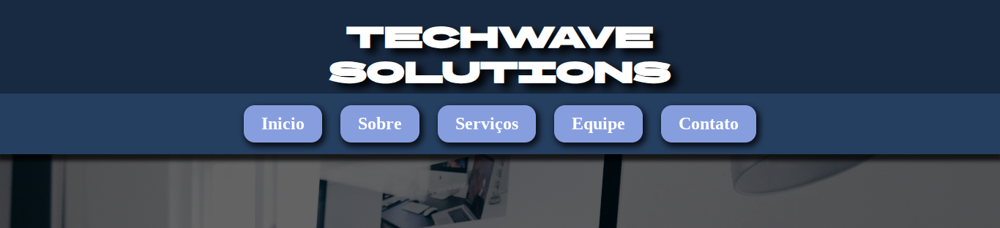

# TechWave Solutions

[Ver site ao vivo](https://gsales2.github.io/TechWave-Solution/)

Este é um site institucional fictício que desenvolvi para praticar HTML e CSS.  
A ideia foi simular uma empresa de tecnologia moderna e usar o projeto como uma forma de aplicar o que aprendi sobre estrutura, responsividade e design limpo.

---

## Contexto

Esse foi meu primeiro projeto mais completo.  
Quis criar algo que parecesse profissional, mesmo sendo feito apenas com HTML e CSS, sem frameworks.  
Durante o processo, trabalhei na organização das seções, no layout responsivo e em deixar tudo funcional em diferentes tamanhos de tela.

---

## Principais aprendizados

- Criação de um layout institucional do zero;
- Uso de media queries para adaptar o site a dispositivos diferentes;
- Organização do código e das pastas do projeto;
- Aplicação de boas práticas de espaçamento, hierarquia e contraste;
- Cuidados com o visual e harmonia entre cores e fontes.

---

## Estrutura do projeto

techwave/
│
├── index.html
├── style.css
├── README.md
└── assets/
    ├── img/
    └── icons/

---

## Tecnologias utilizadas

- HTML5  
- CSS3  
- Google Fonts  
- Imagens otimizadas (WebP)  
- Favicon personalizado

---

## Como visualizar

Basta abrir o arquivo `index.html` em qualquer navegador.  
O site foi desenvolvido de forma responsiva, então funciona bem em telas grandes e pequenas.

---

## Autor

Projeto desenvolvido por **Gabriel Sales**.  
Criado com o objetivo de aprendizado e portfólio pessoal.
